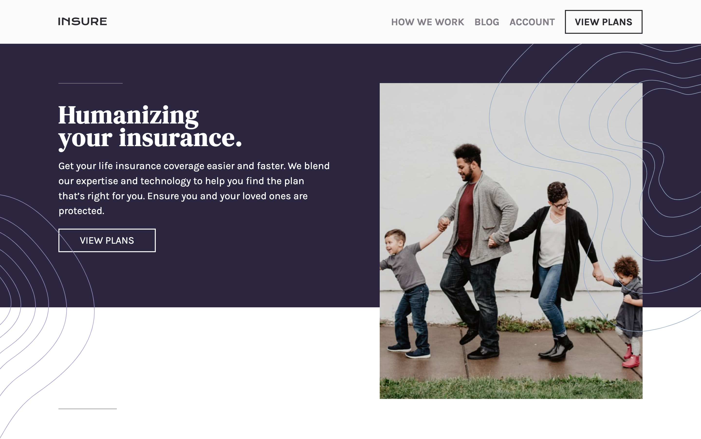

# Frontend Mentor - Insure landing page solution

## Table of contents

- [Overview](#overview)
  - [The challenge](#the-challenge)
  - [Screenshot](#screenshot)
  - [Links](#links)
- [My process](#my-process)
  - [Built with](#built-with)
- [Author](#author)
- [Acknowledgments](#acknowledgments)

**Note: Delete this note and update the table of contents based on what sections you keep.**

## Overview

Build this webpage with HTML, CSS and Javascript taking mobile-first approach

### The challenge

Users should be able to:

- View the optimal layout for the site depending on their device's screen size
- See hover states for all interactive elements on the page

### Screenshot

.png>)

### Links

- Solution URL: [Solution URL here](https://github.com/ahmedsaliuGit/insure-landing-page)
- Live Site URL: [Live site URL here](https://ahmedsaliugit.github.io/insure-landing-page/)

## My process

### Built with

- Semantic HTML5 markup
- CSS custom properties
- Flexbox
- Mobile-first workflow

## Author

- Website - [Ahmed Saliu](https://github.com/ahmedsaliuGit/)
- Frontend Mentor - [@yourusername](https://www.frontendmentor.io/profile/ahmedsaliuGit)

## Acknowledgments

Frontend Mentor thnak you.
